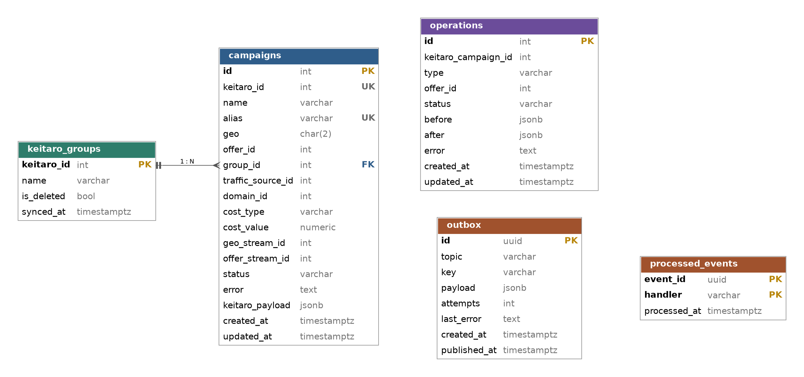

# База данных

Keitaro — источник правды по кампаниям, потокам и офферам. В нашей БД хранится только то, чего нет в Keitaro или что нужно нам самим: справочник групп для поиска, кампании, созданные через сервис, журнал изменений редактора и служебные таблицы для надёжной доставки событий.

Все изменяющие операции (создание кампании, добавление и удаление офферов, синк групп) выполняются асинхронно через события. API не вызывает Keitaro для записи: он сохраняет намерение в БД и событие в `outbox` в одной транзакции, а воркер выполняет работу.

## ER-диаграмма

## Таблицы

### `keitaro_groups`

Локальная копия групп кампаний из Keitaro для поиска по названию. Заполняется периодическим синком через воркер.

- Первичный ключ — ID из Keitaro, своего суррогатного ID нет.
- Группы, удалённые в Keitaro, помечаются `is_deleted = true`, а не удаляются физически: на них могут ссылаться кампании.

### `campaigns`

Кампании, созданные через сервис. Строка появляется в статусе `pending` в момент запроса из API, дальше статус меняет воркер.

- `alias` генерируется при создании строки, до обращения к Keitaro. Если воркер упал после того, как Keitaro создал кампанию, но до сохранения её ID, при повторной обработке кампания находится в Keitaro по alias, а не создаётся второй раз.
- `keitaro_id`, `geo_stream_id` и `offer_stream_id` сохраняются сразу после каждого шага. При повторной доставке события воркер продолжает с места остановки, а при ошибке знает, что откатывать.
- `rollback_failed` означает, что откат тоже не удался и в Keitaro могли остаться сущности, которые нужно проверить вручную.
- `keitaro_payload` хранит ответ Keitaro целиком для отладки. Мы не зависим от его структуры.

### `operations`

Изменения, запрошенные через редактор. Строка создаётся в статусе `pending`, воркер переводит её в `success` или `failed`.

- `keitaro_campaign_id` без внешнего ключа: редактор работает с любой кампанией Keitaro, а не только с созданными через сервис.
- `before` и `after` хранят список офферов потока до и после изменения.

### `outbox`

Transactional outbox. Событие записывается в той же транзакции, что и изменение данных (`campaigns` или `operations`), поэтому ситуация «данные сохранены, а событие потерялось» невозможна.

- Отдельный процесс (relay) выбирает неопубликованные события через `SELECT ... WHERE published_at IS NULL ORDER BY created_at LIMIT N FOR UPDATE SKIP LOCKED`, публикует их в Redpanda и проставляет `published_at`. `SKIP LOCKED` позволяет запускать несколько relay без двойной публикации одной пачки.
- Частичный индекс `WHERE published_at IS NULL` держит выборку быстрой при росте таблицы.
- `key` задаёт ключ партиции, например ID кампании. События одной кампании попадают в одну партицию и обрабатываются по порядку.
- Опубликованные события можно периодически чистить.

### `processed_events`

Идемпотентность на стороне потребителя (inbox). Outbox гарантирует доставку «хотя бы один раз», поэтому одно событие может прийти повторно, например если relay упал после публикации, но до записи `published_at`.

- Хендлер в одной транзакции со своей работой записывает `(event_id, handler)`. Если такая запись уже есть, событие пропускается.
- Ключ составной: одно событие могут обрабатывать разные хендлеры, и каждый отмечает его независимо.
- Для шагов, которые вызывают Keitaro, этой таблицы недостаточно: внешний вызов не входит в транзакцию БД. Их защищает логика из `campaigns` (поиск по alias, сохранённые ID шагов).
