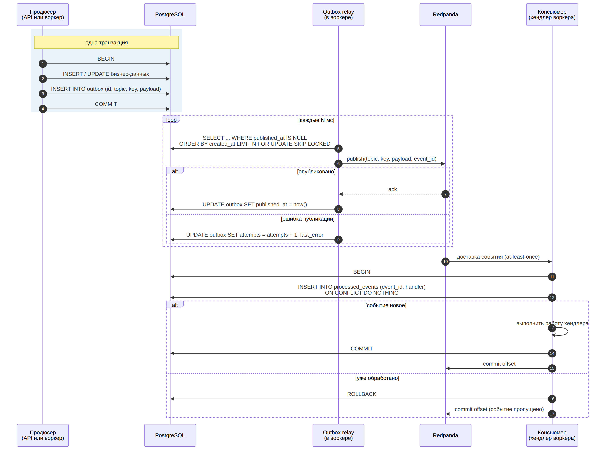
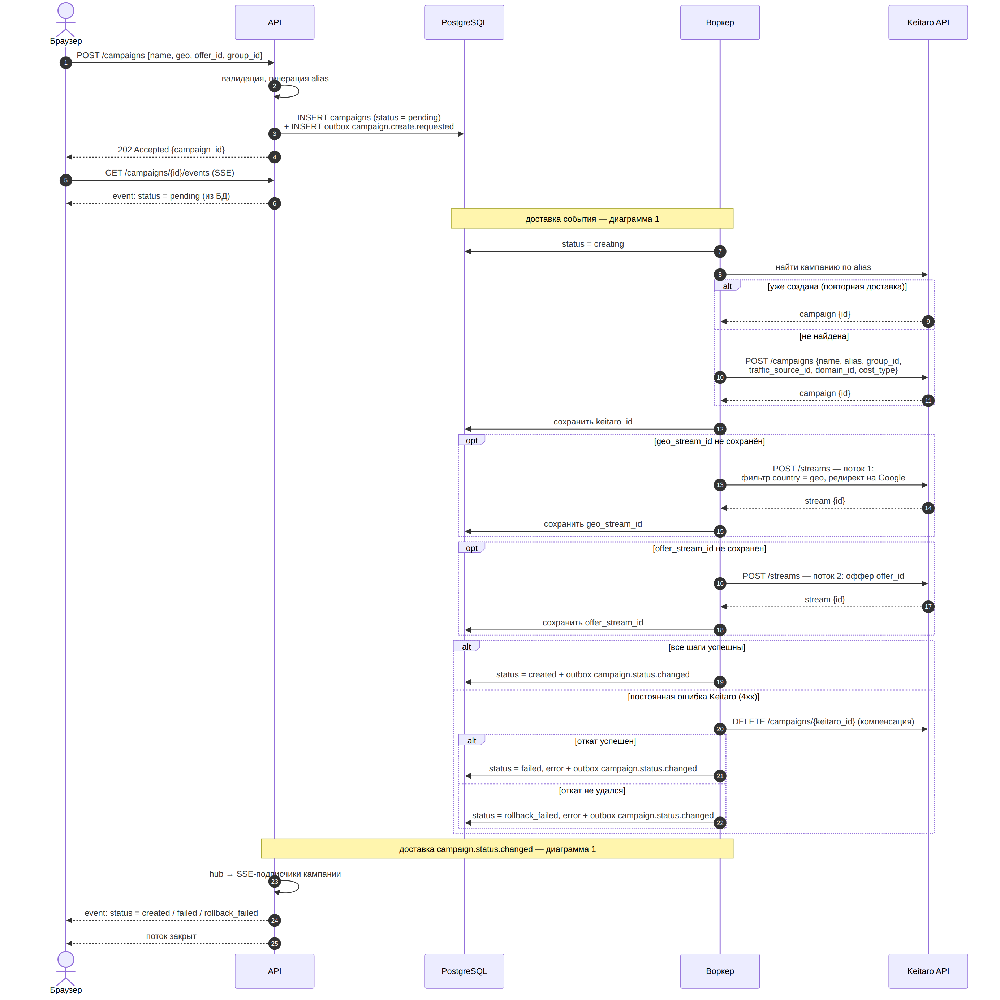
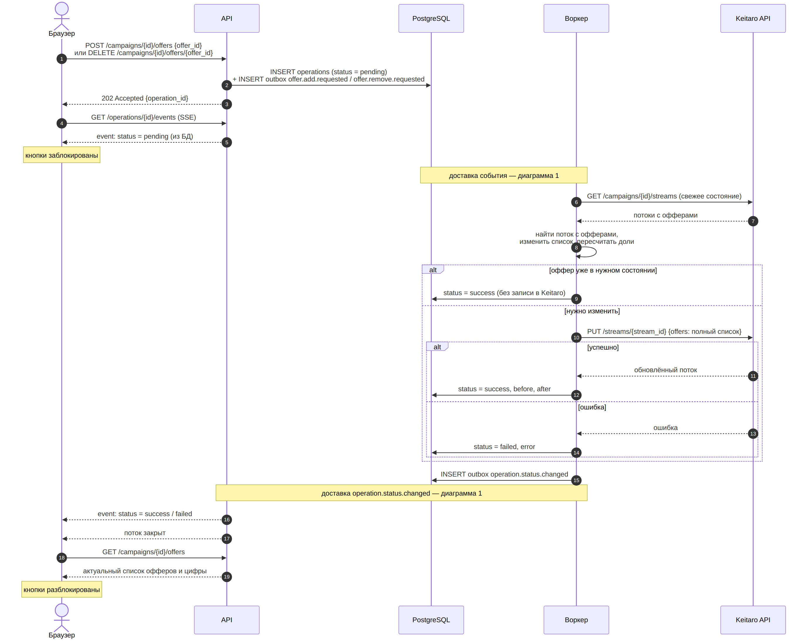
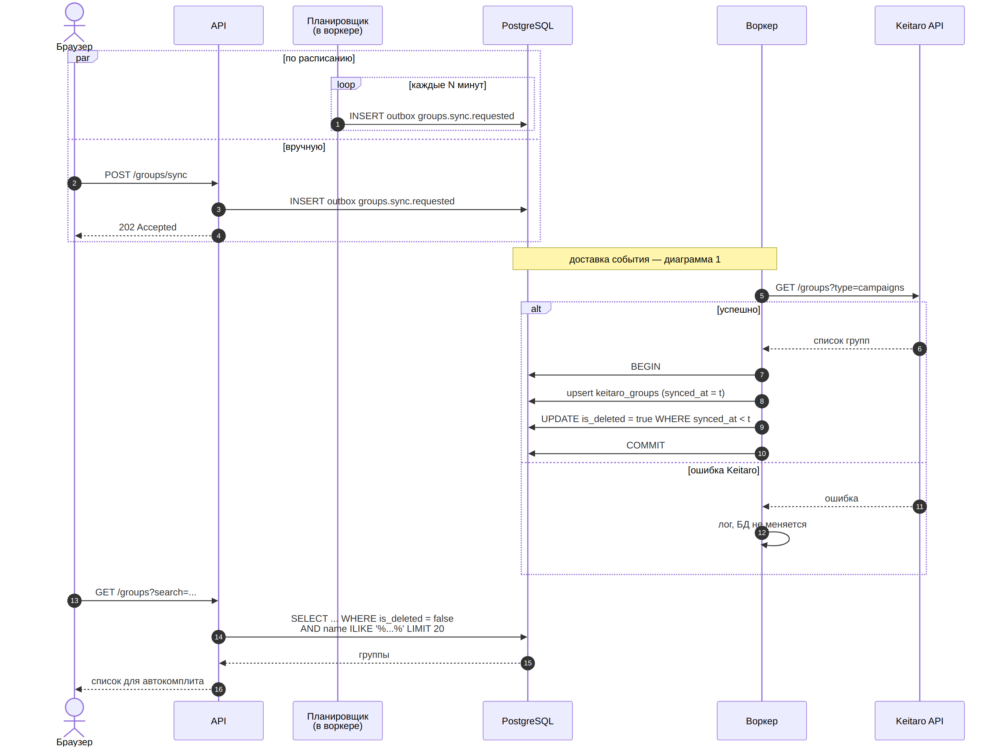

# Диаграммы последовательности

Четыре диаграммы описывают все процессы сервиса. Первая показывает механизм доставки событий, общий для всех операций. Остальные три описывают бизнес-процессы и ссылаются на первую, вместо того чтобы повторять одни и те же шаги.

| № | Диаграмма | Отвечает на вопрос |
|---|-----------|--------------------|
| 1 | [Доставка события](#1-доставка-события) | Как событие гарантированно доходит до обработчика |
| 2 | [Создание кампании](#2-создание-кампании) | Как создаётся кампания и что происходит при ошибке |
| 3 | [Добавление и удаление оффера](#3-добавление-и-удаление-оффера) | Как меняются офферы кампании |
| 4 | [Синхронизация групп](#4-синхронизация-групп) | Откуда берутся группы для поиска |

Номера шагов в тексте соответствуют номерам на диаграммах.

---

## 1. Доставка события

Transactional outbox на стороне продюсера и идемпотентный консьюмер (inbox) на стороне обработчика.

**Запись события (шаги 1–4).** Продюсер сохраняет бизнес-данные и событие в таблицу `outbox` в одной транзакции. Либо сохраняется и то и другое, либо ничего, поэтому ситуация «данные записаны, а событие потерялось» невозможна.

**Публикация (шаги 5–9).** Relay работает в процессе воркера и периодически забирает неопубликованные события. `FOR UPDATE SKIP LOCKED` позволяет запускать несколько relay параллельно: каждый берёт свою пачку, и одна строка не публикуется двумя процессами одновременно. При ошибке публикации событие остаётся в `outbox` и будет отправлено в следующий раз, а `attempts` и `last_error` помогают найти застрявшие события.

**Почему возможны дубли.** Если relay опубликовал событие, но упал до того, как записал `published_at`, после перезапуска он опубликует его снова. Outbox гарантирует доставку «хотя бы один раз», но не «ровно один раз».

**Обработка (шаги 10–16).** Консьюмер записывает `(event_id, handler)` в `processed_events` в той же транзакции, что и свою работу. Если запись уже есть, событие уже обработано, и его можно пропустить. Offset в Redpanda подтверждается только после коммита в БД: если воркер упадёт между этими шагами, событие придёт снова и будет отсеяно на шаге 11.

**Ограничение.** Таблица `processed_events` защищает только работу внутри БД. Вызовы Keitaro API в транзакцию не входят, поэтому хендлеры, которые их делают, дополнительно защищены своей логикой (см. диаграммы 2 и 3).

---

## 2. Создание кампании

**Приём запроса (шаги 1–6).** API валидирует данные и сразу генерирует alias. Кампания сохраняется в статусе `pending` вместе с событием в `outbox`, и API отвечает `202 Accepted`, не дожидаясь Keitaro. Браузер открывает SSE-соединение и первым сообщением получает текущий статус из БД. Подписка на обновления открывается до чтения из БД, поэтому, даже если кампания успела создаться до подключения браузера, статус не потеряется.

**Создание в Keitaro (шаги 7–18).** Воркер выполняет три шага и сохраняет результат каждого в БД сразу после выполнения. Каждый шаг защищён от повторов:

- **кампания** (шаги 8–12): перед созданием воркер ищет её по alias. Если воркер упал после того, как Keitaro создал кампанию, но до сохранения `keitaro_id`, при повторе кампания найдётся, и дубль не появится;
- **потоки** (шаги 13–18): выполняются, только если их ID ещё не сохранены, поэтому при повторной обработке воркер продолжает с места остановки, а не начинает заново.

**Результат (шаги 19–22).** Ошибки делятся на два вида:

- **временные** (таймаут, 5xx, недоступность Keitaro) — хендлер не подтверждает событие, и оно приходит повторно. Благодаря сохранённым ID повтор продолжает создание, а не начинает его с нуля. На диаграмме этот путь не показан, поскольку он просто повторяет шаги 7–18;
- **постоянные** (4xx: неверные данные, несуществующий оффер) — повтор не поможет, поэтому запускается компенсация: созданная кампания удаляется вместе с потоками. Если не удался и откат, кампания получает статус `rollback_failed`: в Keitaro могли остаться сущности, которые нужно проверить вручную.

**Уведомление (шаги 23–25).** Смена статуса публикуется событием через тот же outbox. API получает его, передаёт через hub всем SSE-подписчикам этой кампании и закрывает поток на финальном статусе.

---

## 3. Добавление и удаление оффера

Добавление и удаление устроены одинаково и отличаются только изменением списка офферов на шаге 8.

**Приём запроса (шаги 1–5).** API создаёт операцию в статусе `pending` и событие в `outbox`, затем отвечает `202 Accepted` с ID операции. Пока операция не завершена, кнопки редактора заблокированы, чтобы пользователь не отправил несколько конфликтующих изменений.

**Свежее состояние (шаги 6–8).** Воркер читает потоки кампании из Keitaro прямо перед изменением и не использует данные с фронта. `PUT` потока перезаписывает список офферов целиком, поэтому изменение, сделанное на основе устаревших данных, затёрло бы правки, внесённые в админке Keitaro параллельно. После изменения списка пересчитываются доли офферов по логике существующего редактора.

**Идемпотентность (шаги 9–14).** Если оффер уже добавлен или уже удалён, операция считается успешной без запроса в Keitaro. Повторная доставка того же события ничего не ломает. В `operations` сохраняются списки офферов до и после изменения.

**Порядок операций.** Ключ партиции события — ID кампании. Все операции одной кампании попадают в одну партицию Redpanda и обрабатываются строго по очереди, поэтому два быстрых изменения одной кампании не выполняются параллельно и не затирают друг друга.

**Обновление интерфейса (шаги 15–19).** После финального статуса по SSE браузер запрашивает актуальный список офферов и цифры и разблокирует кнопки.

---

## 4. Синхронизация групп

**Два источника запуска (шаги 1–4).** Планировщик в воркере раз в N минут создаёт событие `groups.sync.requested`. Пользователь может запустить синк вручную, если только что создал группу в Keitaro и не хочет ждать. Оба пути идут через outbox, как и все остальные события.

**Синхронизация (шаги 5–10).** Воркер получает группы из Keitaro и одной транзакцией:

- делает upsert: новые группы добавляются, переименованные обновляются;
- помечает удалёнными группы, которых не было в ответе. Время `t` фиксируется один раз в начале синка, и все полученные группы получают `synced_at = t`. Группы с более ранним `synced_at` в ответе отсутствовали, значит, в Keitaro их удалили. Физически они не удаляются, потому что на них могут ссылаться кампании.

**Ошибка Keitaro (шаги 11–12).** Если Keitaro недоступен, воркер пишет ошибку в лог и не трогает БД. Поиск продолжает работать на данных последнего успешного синка.

**Повторы безопасны.** Если синк запустится дважды подряд (например, по расписанию и вручную одновременно), второй просто перезапишет те же данные: upsert идемпотентен.

**Поиск (шаги 13–16).** Поиск для автокомплита идёт только по локальной таблице, без запросов в Keitaro. Удалённые группы в выдачу не попадают.

---

